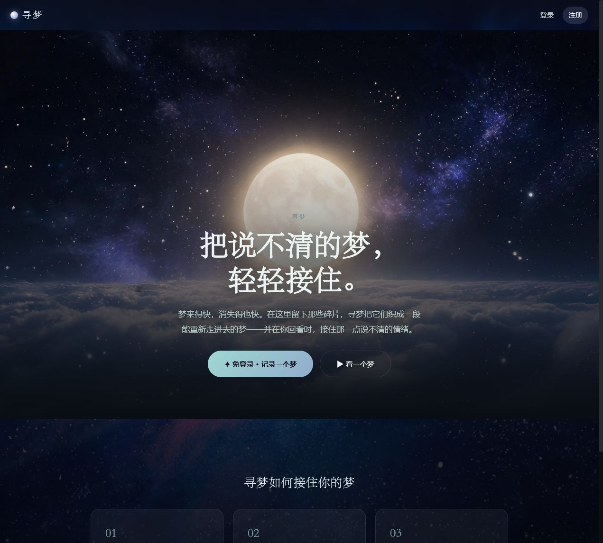
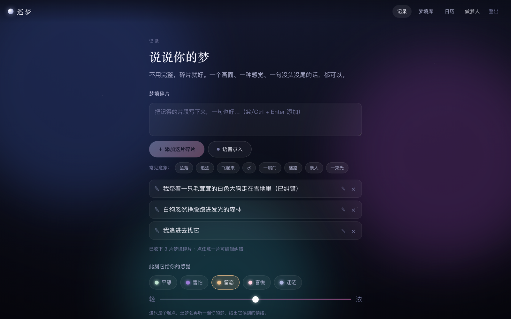
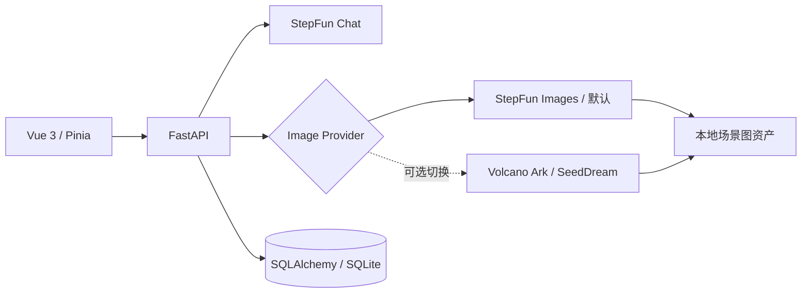

# 寻梦



把醒来后说不清的梦境碎片，织成可以观看、漫游和长期回看的私人梦境。

本仓库基于已获授权的完整系统迁入，完成了《寻梦》品牌改版、前端体验优化、StepFun 文本与图像模型迁移、可切换的火山 SeedDream 图片适配、本地图片持久化和一键运行工程化。

## 产品亮点

- 文本与语音降低半睡半醒时的记录成本。
- 两阶段 AI 先抽取事实，再生成统一风格的分场景叙事。
- 叙事先返回，场景图后台渐进生成并逐张落库。
- 临时图片立即下载到本地，避免供应商 URL 过期。
- 沉浸体验、收梦仪式、日历和梦境库形成长期回看闭环。



## 技术架构



## 本地运行

要求 Node.js 20+ 与 Python 3.11–3.13。

```powershell
python -m venv backend\.venv
.\backend\.venv\Scripts\python -m pip install -r backend\requirements.txt
npm install --prefix frontend

# 终端 1
cd backend
.\.venv\Scripts\python -m uvicorn app.main:app --host 127.0.0.1 --port 8003

# 终端 2
npm run dev --prefix frontend
```

前端：`http://127.0.0.1:3003`  
后端文档：`http://127.0.0.1:8003/docs`

复制 `backend/config.env.example` 为 `backend/config.env` 并设置 `STEPFUN_API_KEY`，即可启用默认的 StepFun 文本与图片生成。需要切换火山生图时，将 `IMAGE_PROVIDER` 改为 `volcano`，并单独设置 `VOLCANO_API_KEY` 和 `VOLCANO_IMAGE_MODEL`；不要复用 StepFun Key，也不要提交配置文件、数据库、生成图片或日志。

## 验证

```powershell
.\backend\.venv\Scripts\python -m compileall backend\app
$env:PYTHONPATH = "$PWD\backend"
.\backend\.venv\Scripts\python -m unittest discover -s backend\tests -v
npm run typecheck --prefix frontend
npm run build
npm run qa:model
```

本地降级链路已验证注册、创建梦境、三场景生成、详情和持久化。`npm run qa:model` 会创建独立验收账号和梦境，核验真实 StepFun 文本模型、三张非 SVG 场景图和本地持久化 URL，并生成不入库的 `MODEL_QA_RUN.json`；缺少密钥时该验收应失败。

## 深入阅读

- [产品与技术案例拆解](docs/作品案例拆解.md)
- [演示与运行手册](docs/演示与运行手册.md)
